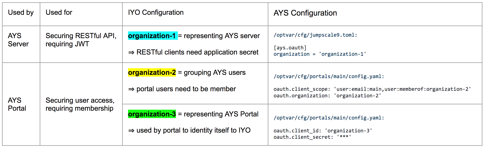

# Installation of an AYS Portal

In order to install an AYS Portal you need a JumpScale environment with the JumpScale portal framework installed, so AYS Portal is actually a JumpScale portal app, just as for instance the Cloud Broker Portal that comes with OpenvCloud.

The JumpScale portal framework is installed as part of a JS9 Docker image you get when using the `ZInstall_portal9` command, as documented in the [jumpscale/bash](https://github.com/Jumpscale/bash/blob/master/README.md) repository.

In case you did use `ZInstall_host_js9_full` or `ZInstall_js9_full` you still need to:
- [Install the portal framework](#portal9)
- [Install AYS and the AYS Portal](#ays9)

<a id="portal9"></a>
## Install the portal framework

You can either install the Portal framework by manually cloning the [jumpscale/portal9](https://github.com/Jumpscale/portal9) repository or using the JumpScale interactive shell.

Manually cloning:
```bash
cd /opt/code/github/jumpscale
git clone git@github.com:Jumpscale/portal9.git
```

Or using the interactive shell:
```python
prefab = j.tools.prefab.local
prefab.apps.portal.install()
```

As discussed below you can also install the portal framework as part of the AYS installation, through one single command, using the `install_portal` when using the JumpScale.


<a id="ays9"></a>
## Install AYS and the AYS Portal

Both are part of the [jumpscale/ays9](https://github.com/Jumpscale/ays9) repository.

Installing the repository manually:
```bash
cd /opt/code/github/jumpscale
git clone git@github.com:Jumpscale/ays9.git
```

Or using the interactive shell:
```
prefab = j.tools.prefab.local
prefab.apps.atyourservice.install()
```

Alternativelly you can use the `install_portal` option which will also install/reinstall the portal framework:
```python
prefab = j.tools.prefab.local
prefab.apps.atyourservice.install(install_portal=True)
# Load ays space into portal
prefab.apps.atyourservice.load_ays_space()
# configure portal to point to ays location
prefab.apps.atyourservice.configure_portal(host='http://172.17.0.5', port="5000")
```

Installing the AYS Portal using JumpScale will automatically start the AYS Portal in a new TMUX window.


## Starting the AYS Portal

In case you manually installed the [jumpscale/ays9](https://github.com/Jumpscale/ays9) repository you need to start AYS and the portal manually. This can be achieved either from the command line or by using the JumpScale interactive shell.

Starting AYS from the command line:
```bash
ays start -b 0.0.0.0 -p 5000
```

Or starting AYS using JumpScale:
```python
j.tools.prefab.local.apps.atyourservice.start()
```

Starting the AYS Portal from the command line:
```bash

```

Or using the JumpScale:
```python
j.tools.prefab.local.apps.portal.start()
```

Starting AYS Portal will also start MongoDB in a window of the same TMUX session used for the AYS and the AYS Portal. If needed you can always start MongoDB manually:
```python
j.tools.prefab.local.apps.mongodb.start()
```

The AYS Portal is configured in `/opt/cfg/portals/main/config.yaml`, which is the configuration that common to all portal apps using the JumpScale portal framework in your JumpScale environment.

Here's the default configuration:
```yaml
mongoengine.connection:
    host: 'localhost'
    port: 27017

rootpasswd: 'admin'

ipaddr: '127.0.0.1'
port: '8200'
appdir: '$JSAPPSDIR/portals/portalbase'
filesroot: '$VARDIR/portal/files'
defaultspace: 'system'
admingroups:
    - 'admin'
authentication.method: 'me'
gitlab.connection: 'main'
force_oauth_instance: ''  # set to use oauth
contentdirs: ''

production: False

oauth.client_url: 'https://itsyou.online/v1/oauth/authorize'
oauth.token_url: 'https://itsyou.online/v1/oauth/access_token'
oauth.redirect_url: 'http://ae5d255c.ngrok.io/restmachine/system/oauth/authorize'
oauth.client_scope: 'user:email:main,user:memberof:JSPortal'
oauth.organization: 'testOrg'
oauth.client_id:  'JSPortal'
oauth.client_secret:  '8plUHNtpaQp8NExkRa-3MYa1SWkOr1mgEqRxGBm25DD78tHXiIlS'
oauth.client_user_info_url:  'https://itsyou.online/api/users/'
oauth.client_logout_url:  ''

oauth.default_groups:
    - admin
    - user
```

In order to activate ItsYou.online integration, you'll need to update following items:
```yaml
force_oauth_instance: 'itsyouonline'
production: true

oauth.redirect_url: 'http://172.25.226.34:8200/restmachine/system/oauth/authorize'

oauth.client_scope: 'user:email:main,user:memberof:organization-2'
oauth.organization: 'organization-2'

oauth.client_id: 'organization-3'
oauth.client_secret:  '****'
```

- `force_oauth_instance` and `production` both need to be set as above in order to activate the ItsYou.online authorization
- `oauth.redirect_url` specifies the callback URL that will be passed to ItsYou.online, update it with the URL where your AYS Portal is available
- `oauth.client_scope` and `oauth.organization` both include the name of the ItsYou.online organization (here `organization-2`) to which you as an AYS Portal user need to be member; this can be the same organization as specified for `client_id`
- `oauth.client_id` specifies the name of the ItsYou.online organization (here `organization-3`) as which the AYS Portal identifies itself to ItsYou.online; as an AYS Portal user you are not necessairly owner or member of this organization, but it is supported to specify the same organization as specified in ``oauth.organization``
- `oauth.client_secret` is a client secret for the organization specified in `oauth.client_id`


While you can specify the same organization for both `oauth.organization` and `oauth.client_id`, which can even be the same organization as specified in the [AYS Server Configuration](../../gettingstarted/ays-server-configuration.md), it is supported to use 3 distinct ItsYou.online organizations. The below table clarifies how the three organizations are used.



If you need to link the portal with a remote AYS server, you need to add `ays_uri` parameter in portal config file `/opt/cfg/portals/main/config.yaml`
`ays_uri: http://REMOTE_URL:REMOTE_AYS_PORT`
After having updated the configuration, you'll need to restart the portal. This is typically achieved by using CTRL+C in the TMUX window where the portal is running, and re-executing the last command.
