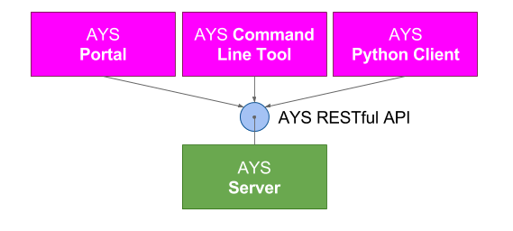

# AYS

## What is AYS?

The elevator pitch:
- AYS is an abbreviation for "At Your Service"
- AYS is an "[Infrastructure as Code](https://en.wikipedia.org/wiki/Infrastructure_as_Code)" application lifecycle management system for cloud infrastructure and applications
- AYS is installed as part of a JumpScale

AYS combines functions such as:
- **Package Management** by allowing you to package multi-component applications and have AYS do the installation
- **Service Management** by making starting and stopping applications simple without having to bother about the details
- **Configuration Management** by centralizing configuration of all applications and their components
- **Monitoring Tool** by keeping applications healthy through monitoring of all components and act on problems when needed

## AYS server

AYS server is the core component of AYS.

AYS server automates the full lifecycle of the cloud infrastructure and applications it manages, from deployment, monitoring, auto-scaling, self-healing to uninstalling all components it manages.

## AYS clients

Interaction with the AYS server is done through the AYS RESTful APIs, the Python client, the AYS command line tool for Linux, or the AYS Portal, also know as the "Cockpit", which is a web user interface. Both the Python client, the AYS command line tool and the AYS Portal as basically clients to the AYS RESTful API.

The best way to get acquainted with AYS is using the AYS command line tool, as documented in [AYS Commands](Commands/README.md).

## AYS services

Each application or application component managed by AYS is represented by an AYS service.

So an AYS service can be seen as an AYS server-hosted proxy for an application or any of its components.

A service is an abstraction for almost anything:

- Simple package i.e. `MongoDB`
- Server cluster i.e. `MongoDB cluster`
- Datacenter infrastructure i.e. `rack(s) or a cluster of machines`
- Buisness logic i.e. `user` and `team`
- Abstraction for any number of other AYS services

See [AYS Services](Definitions/Services.md) for more details.

## Blueprints

When interacting with the AYS server you typically send blueprints.

Through a blueprint you specify to AYS what needs to be done, such as instantiating AYS services and having them things done.

See [Blueprints](Definitions/Blueprints.md) for more details.

## Next

Next you will want to learn about:
- [AYS Definitions](Definitions/README.md)
- [AYS Commands](Commands/README.md)

Or jump to:
- [Getting Started](gettingstarted/README.md)
- [Walkthroughs](walkthroughs/README.md)
- [How To's](Howto/README.md)

See the [Table of Contents](SUMMARY.md) for an overview of all topics.
